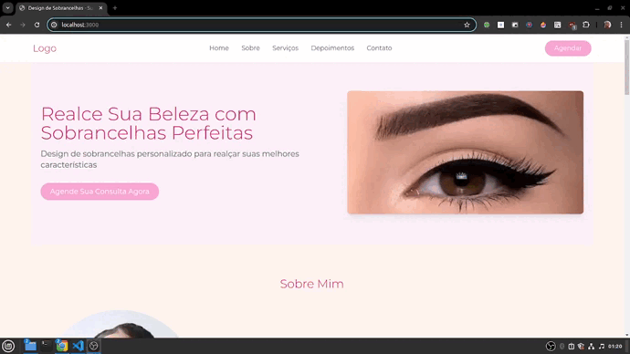

Design de Sobrancelhas - Web Site
============================================

Este é um projeto de um site de design de sobrancelhas, desenvolvido com Next.js. O objetivo é proporcionar uma aparência perfeita e natural para os clientes, destacando sua beleza.

Sumário
-------

-   [Sobre](#sobre)
-   [Tecnologias Utilizadas](#tecnologias-utilizadas)
-   [Instalação](#instala%C3%A7%C3%A3o)
-   [Uso](#uso)
-   [Funcionalidades](#funcionalidades)
-   [Contribuição](#contribui%C3%A7%C3%A3o)
-   [Licença](#licen%C3%A7a)
-   [Contato](#contato)

Sobre
-----

Este projeto é uma aplicação web desenvolvida para um designer de sobrancelhas. O site permite que os clientes conheçam os serviços oferecidos, vejam depoimentos, conheçam o portfólio, tirem dúvidas frequentes e entrem em contato para agendar um horário.

Tecnologias Utilizadas
----------------------

-   [Next.js](https://nextjs.org/) - Framework React para renderização do lado do servidor.
-   [React](https://reactjs.org/) - Biblioteca JavaScript para construir interfaces de usuário.
-   [Tailwind CSS](https://tailwindcss.com/) - Framework CSS para estilização.
-   [Vercel](https://vercel.com/) - Plataforma de hospedagem para aplicativos front-end.

Instalação
----------

Para instalar e rodar o projeto localmente, siga os passos abaixo:

1.  **Clone o repositório:**

`https://github.com/developedbyBob/web-sombrancelha.git`

1.  **Navegue até o diretório do projeto:**

`cd nome-do-projeto`

1.  **Instale as dependências:**

`npm install`

1.  **Inicie o servidor de desenvolvimento:**

`npm run dev`

O projeto estará disponível em `http://localhost:3000`.

Uso
---

-   Navegue até a URL `http://localhost:3000` no seu navegador.
-   Explore as diferentes seções do site: Sobre, Serviços, Depoimentos, Portfólio, FAQ e Contato.
-   Use os links rápidos no rodapé para acessar os Termos de Serviço e a Política de Privacidade.

Funcionalidades
---------------

-   **Navegação Simples**: Use a barra de navegação para acessar diferentes seções do site.
-   **Design Responsivo**: O site é responsivo e funciona bem em dispositivos móveis e desktops.
-   **Agendamento**: Possibilidade de entrar em contato para agendar um horário.
-   **Termos de Serviço e Política de Privacidade**: Links rápidos para acessar informações importantes.

Contribuição
------------

Contribuições são bem-vindas! Para contribuir, siga os passos abaixo:

1.  Faça um fork do projeto.
2.  Crie uma branch para sua feature ou correção (`git checkout -b feature/nova-feature`).
3.  Commit suas alterações (`git commit -m 'Adiciona nova feature'`).
4.  Envie para a branch (`git push origin feature/nova-feature`).
5.  Abra um Pull Request.

Licença
-------

Este projeto está licenciado sob a MIT License.

* * * * *

Sinta-se à vontade para personalizar esse README conforme necessário para atender às especificidades do seu projeto.

<!-- GitHub Linguist: language=JavaScript -->
